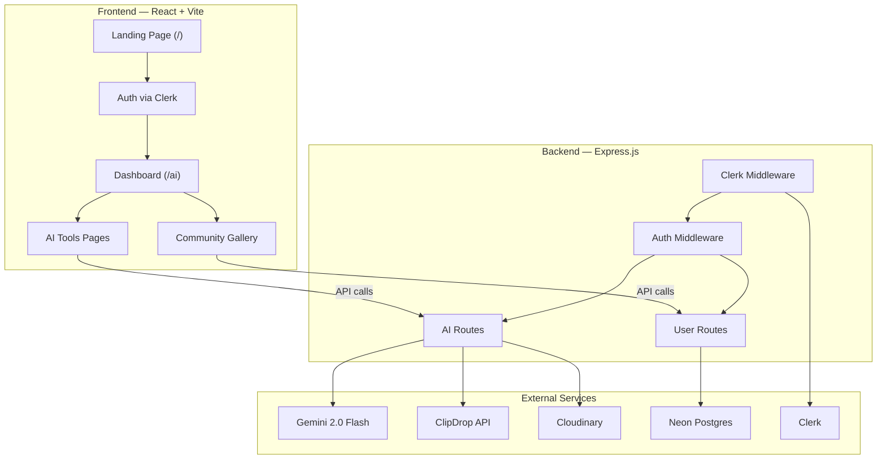
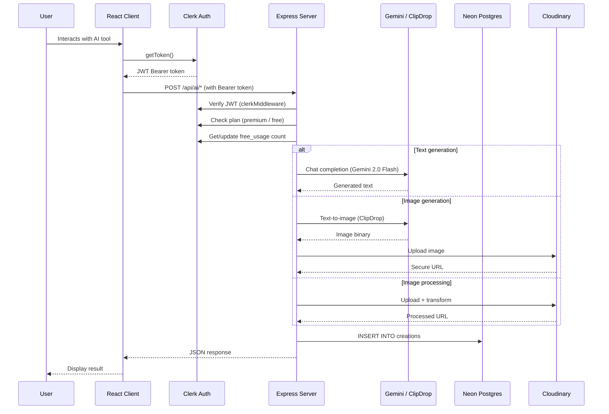
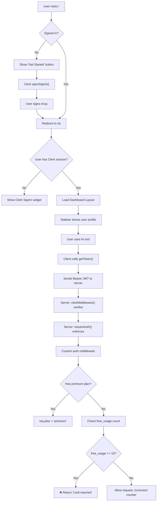

# 📘 Promptly AI — Complete Project Documentation

> **Project Name:** Promptly AI (Quick-AI)
> **Type:** AI-Powered SaaS Content Creation Platform
> **Developer:** [Haider Ali](https://www.linkedin.com/in/haidersince2002/) • [GitHub](https://github.com/haidersince2002)
> **Year:** 2025 — Final Year Project

---

## 1. Project Overview

**Promptly AI** is a full-stack, AI-powered SaaS (Software as a Service) web application that provides users with a suite of premium AI tools for content creation. Users can generate articles, blog titles, images, remove image backgrounds, remove objects from images, and get their resumes reviewed—all through a clean, modern dashboard interface.

The platform implements a **freemium monetization model**: free-tier users get 10 AI generations, while premium subscribers ($9/month) unlock unlimited access to all features including image-related tools.

### Key Highlights

- 🧠 **6 AI-Powered Tools** — Article writing, blog title generation, image generation, background removal, object removal, resume review
- 🔐 **Secure Authentication** — Clerk-based auth with sign-in/sign-up, user profiles, and plan management
- 💎 **Freemium Model** — Free (10 uses) and Premium ($9/mo) plans via Clerk Billing
- 🖼️ **Community Gallery** — Users can publish AI-generated images and like each other's work
- ☁️ **Cloud-Native** — Deployed on Vercel with Neon serverless Postgres and Cloudinary CDN
- 📱 **Fully Responsive** — Works seamlessly on desktop, tablet, and mobile devices

---

## 2. Tech Stack — With Exact Versions

### Frontend (Client)

| Technology | Version | Purpose |
|---|---|---|
| **React** | `19.1.0` | UI library — component-based architecture |
| **React DOM** | `19.1.0` | DOM rendering for React |
| **Vite** | `7.0.4` | Build tool & dev server — HMR, fast bundling |
| **Tailwind CSS** | `4.1.11` | Utility-first CSS framework (v4 with `@theme`) |
| **@tailwindcss/vite** | `4.1.11` | Tailwind CSS Vite plugin |
| **React Router DOM** | `7.7.0` | Client-side routing with nested routes |
| **@clerk/clerk-react** | `5.35.3` | Authentication, user management, billing UI |
| **Axios** | `1.11.0` | HTTP client for API calls |
| **Lucide React** | `0.525.0` | Icon library (modern, tree-shakeable) |
| **React Hot Toast** | `2.5.2` | Toast notifications |
| **React Markdown** | `10.1.0` | Render Markdown content from AI responses |
| **ESLint** | `9.30.1` | Code linting |
| **@vitejs/plugin-react** | `4.6.0` | React plugin for Vite |

### Backend (Server)

| Technology | Version | Purpose |
|---|---|---|
| **Node.js** | Runtime | JavaScript runtime environment |
| **Express** | `5.1.0` | Web framework (Express v5) |
| **@clerk/express** | `1.7.13` | Server-side Clerk auth middleware |
| **OpenAI SDK** | `5.10.2` | AI model access (using Google Gemini via OpenAI-compatible API) |
| **@neondatabase/serverless** | `1.0.1` | Serverless Postgres client (Neon) |
| **Cloudinary** | `2.7.0` | Cloud-based image storage & transformation |
| **Multer** | `2.0.2` | File upload middleware (multipart/form-data) |
| **Axios** | `1.11.0` | HTTP client (for ClipDrop API calls) |
| **pdf-parse** | `1.1.1` | PDF text extraction (for resume review) |
| **dotenv** | `17.2.1` | Environment variable management |
| **CORS** | `2.8.5` | Cross-Origin Resource Sharing |
| **Nodemon** | `3.1.10` | Auto-restart dev server on file changes |

### External Services & APIs

| Service | Purpose |
|---|---|
| **Google Gemini 2.0 Flash** | AI text generation (articles, titles, resume reviews) via OpenAI-compatible endpoint |
| **ClipDrop API** | Text-to-image generation |
| **Cloudinary** | Image upload, storage, CDN, background removal, object removal via AI transformations |
| **Clerk** | Authentication, user management, session handling, billing/subscriptions |
| **Neon** | Serverless PostgreSQL database |
| **Vercel** | Deployment platform (both client and server) |

### AI Model Details

| Model | Provider | Endpoint | Uses |
|---|---|---|---|
| **gemini-2.0-flash** | Google (via OpenAI SDK) | `generativelanguage.googleapis.com/v1beta/openai/` | Article writing, blog titles, resume review |
| **ClipDrop text-to-image v1** | Stability AI | `clipdrop-api.co/text-to-image/v1` | Image generation |
| **Cloudinary AI** | Cloudinary | Via Cloudinary SDK transformations | Background removal (`background_removal`), object removal (`gen_remove`) |

---

## 3. Architecture Overview



### Request Flow



---

## 4. Complete Feature Breakdown

### 4.1 Landing Page (`/`)

The public-facing homepage that introduces the product:

| Section | Component | Description |
|---|---|---|
| **Navigation** | [Navbar](file:///d:/Projects/Project%20SaaS/QuickAI/Quick-AI/quickai-client/src/components/Navbar.jsx#7-31) | Fixed navbar with logo, "Get started" button (or `UserButton` if signed in), backdrop blur |
| **Hero** | [Hero](file:///d:/Projects/Project%20SaaS/QuickAI/Quick-AI/quickai-client/src/components/Hero.jsx#4-42) | Full-screen section with gradient background, headline, CTA buttons, social proof ("10k+ users") |
| **AI Tools** | [AiTools](file:///d:/Projects/Project%20SaaS/QuickAI/Quick-AI/quickai-client/src/components/AiTools.jsx#6-31) | Grid of 6 tool cards with gradient icons, titles, descriptions, click-to-navigate |
| **Testimonials** | [Testimonial](file:///d:/Projects/Project%20SaaS/QuickAI/Quick-AI/quickai-client/src/components/Testimonial.jsx#3-55) | 3 testimonial cards with star ratings, user photos, quotes |
| **Pricing** | [Plan](file:///d:/Projects/Project%20SaaS/QuickAI/Quick-AI/quickai-client/src/components/Plan.jsx#70-89) | Free vs Premium plan comparison, or Clerk `PricingTable` if billing is enabled |
| **Footer** | [Footer](file:///d:/Projects/Project%20SaaS/QuickAI/Quick-AI/quickai-client/src/components/Footer.jsx#4-104) | Company links, newsletter subscription, copyright, social links |

### 4.2 AI Dashboard (`/ai`)

Authenticated dashboard that shows:
- **Total Creations** count (with blue gradient icon)
- **Active Plan** indicator (Free or Premium, with pink/purple gradient icon)
- **Recent Creations** list — expandable cards showing prompt, type, date, and content (Markdown or image)

### 4.3 AI Tools (6 Features)

#### 1. ✍️ Write Article (`/ai/write-article`)
- **Input:** Topic text + article length (Short 500–800, Medium 800–1200, Long 1200+ words)
- **AI Model:** Gemini 2.0 Flash
- **Output:** Full Markdown article rendered in a side panel
- **Access:** Free (up to 10 uses) and Premium

#### 2. #️⃣ Blog Title Generator (`/ai/blog-titles`)
- **Input:** Keyword + category (General, Technology, Business, Health, Lifestyle, Education, Travel, Food)
- **AI Model:** Gemini 2.0 Flash (max 100 tokens)
- **Output:** Multiple blog title suggestions rendered as Markdown
- **Access:** Free (up to 10 uses) and Premium

#### 3. 🖼️ AI Image Generation (`/ai/generate-images`)
- **Input:** Text description + style (Realistic, Ghibli, Anime, Cartoon, Fantasy, 3D, Portrait) + toggle to publish to community
- **AI Model:** ClipDrop text-to-image API
- **Storage:** Cloudinary (returns secure URL)
- **Access:** Premium only

#### 4. 🧹 Background Removal (`/ai/remove-background`)
- **Input:** Upload image file (JPG, PNG)
- **AI Model:** Cloudinary AI `background_removal` transformation
- **Output:** Processed image with transparent background
- **Access:** Premium only

#### 5. ✂️ Object Removal (`/ai/remove-object`)
- **Input:** Upload image + single object name to remove (e.g., "watch", "spoon")
- **AI Model:** Cloudinary AI `gen_remove` transformation
- **Output:** Image with specified object removed
- **Access:** Premium only

#### 6. 📄 Resume Review (`/ai/review-resume`)
- **Input:** Upload PDF resume (max 5MB)
- **Processing:** PDF text extraction via `pdf-parse`, then Gemini analysis
- **Output:** Constructive feedback on strengths, weaknesses, areas for improvement (Markdown)
- **Access:** Premium only

### 4.4 Community Gallery (`/ai/community`)

- Displays all **published** AI-generated images in a responsive grid
- Image hover reveals the original **prompt** used to generate it
- **Like system:** Users can like/unlike images (toggle), like count displayed
- Likes stored as an array of user IDs in the database

### 4.5 Authentication & Authorization

- **Provider:** Clerk
- **Features:** Sign-in, sign-up, user profiles, `UserButton` component, `SignIn` widget
- **Plan Management:** Clerk's `Protect` component for conditional rendering based on plan
- **Billing:** Optional Clerk `PricingTable` (controlled by `VITE_ENABLE_CLERK_BILLING` env var)

### 4.6 Monetization (Freemium Model)

| Feature | Free Plan | Premium Plan ($9/mo) |
|---|---|---|
| Article generation | ✅ Up to 10 total | ✅ Unlimited |
| Blog title generation | ✅ Up to 10 total | ✅ Unlimited |
| Image generation | ❌ | ✅ Unlimited |
| Background removal | ❌ | ✅ Unlimited |
| Object removal | ❌ | ✅ Unlimited |
| Resume review | ❌ | ✅ Unlimited |
| Community browsing | ✅ | ✅ |
| Dashboard access | ✅ | ✅ |

> [!NOTE]
> Free usage is tracked via Clerk's `privateMetadata.free_usage` field on the user object. The [auth](file:///d:/Projects/Project%20SaaS/QuickAI/Quick-AI/quickai-server/middleware/auth.js#6-29) middleware increments this counter on each use and blocks requests at 10 for non-premium users.

---

## 5. Design System

### 5.1 Color Palette

#### Primary Brand Color
| Name | Hex Code | Usage |
|---|---|---|
| **Primary** | `#5044E5` | CTA buttons, nav links, focus rings, brand identity |

#### Tool-Specific Gradient Colors
Each AI tool has a unique gradient identity:

| Tool | From | To | Preview |
|---|---|---|---|
| **Article Writer** | `#3588F2` | `#0BB0D7` | 🔵 Blue → Cyan |
| **Blog Titles** | `#B153EA` | `#E549A3` | 🟣 Purple → Pink |
| **Image Generation** | `#20C363` | `#11B97E` | 🟢 Green → Teal |
| **Background Removal** | `#F76C1C` | `#F04A3C` | 🟠 Orange → Red |
| **Object Removal** | `#5C6AF1` | `#427DF5` | 🔵 Indigo → Blue |
| **Resume Review** | `#12B7AC` | `#08B6CE` | 🟢 Teal → Cyan |

#### UI Accent Colors
| Element | Colors | Usage |
|---|---|---|
| **Sidebar active** | `#3C81F6` → `#9234EA` | Active nav item gradient |
| **Dashboard "Total Creations"** | `#3588F2` → `#0BB0D7` | Info card icon bg |
| **Dashboard "Active Plan"** | `#FF61C5` → `#9E53EE` | Plan card icon bg |
| **Article submit button** | `#226BFF` → `#65ADFF` | Blue gradient |
| **Blog title submit button** | `#C341F6` → `#8E37EB` | Purple gradient |
| **Image generate button** | `#00AD25` → `#04FF50` | Green gradient |
| **BG removal button** | `#F6AB41` → `#FF4938` | Orange → Red gradient |
| **Object removal button** | `#417DF6` → `#8E37EB` | Blue → Purple gradient |
| **Resume review button** | `#00DA83` → `#009BB3` | Teal gradient |
| **Creation type badge** | bg: `#EFF6FF`, border: `#BFDBFE`, text: `#1E40AF` | Blue badge |
| **Loading spinner** | `border-purple-500` / `border-primary` | Spinner ring |
| **Page background** | `#F4F7FB` | Dashboard content area |
| **Card background** | `#FDFDFE` / `#FFFFFF` | Cards on landing page and dashboard |

#### Neutral Text Colors
| Token | Hex | Usage |
|---|---|---|
| `text-slate-700` | `#334155` | Primary headings |
| `text-slate-600` | `#475569` | Body text in dashboard |
| `text-gray-600` | `#4B5563` | Descriptions, paragraphs |
| `text-gray-500` | `#6B7280` | Subtitles, timestamps |
| `text-gray-400` | `#9CA3AF` | Placeholder / empty state text |

### 5.2 Typography

| Property | Value |
|---|---|
| **Font Family** | [Outfit](https://fonts.google.com/specimen/Outfit) (Google Fonts) |
| **Weight Range** | 100–900 (variable font) |
| **Import** | `@import url("https://fonts.googleapis.com/css2?family=Outfit:wght@100..900&display=swap")` |
| **Application** | Applied globally via `* { font-family: "Outfit", sans-serif; }` |
| **Heading sizes** | `text-[42px]` for section titles, `text-3xl` to `text-7xl` for hero |
| **Body text** | `text-sm` (14px) for most content |
| **Small text** | `text-xs` (12px) for labels, badges, timestamps |

### 5.3 Spacing & Layout

- **Landing page padding:** `px-4 sm:px-20 xl:px-32` (responsive horizontal padding)
- **Dashboard padding:** `p-6`
- **Card padding:** `p-4` to `p-8`
- **Card border radius:** `rounded-lg` (8px) to `rounded-xl` (12px)
- **Card shadows:** `shadow-lg` on landing page tools/testimonials
- **Card borders:** `border border-gray-200` for dashboard cards
- **Section spacing:** `my-24` between landing page sections

### 5.4 Animations & Interactions

| Effect | CSS Classes | Where Used |
|---|---|---|
| **Hover lift** | `hover:-translate-y-1 transition-all duration-300` | Tool cards, testimonial cards |
| **Button scale** | `hover:scale-102 active:scale-95 transition` | Hero CTA buttons |
| **Loading spinner** | `animate-spin border-2 border-t-transparent rounded-full` | Submit buttons, page loaders |
| **Sidebar slide** | `transition-all duration-300 ease-in-out translate-x-0 / -translate-x-full` | Mobile sidebar |
| **Backdrop blur** | `backdrop-blur-2xl` | Fixed navbar |
| **Image hover overlay** | `group-hover:bg-gradient-to-b from-transparent to-black/80` | Community gallery |
| **Heart like scale** | `hover:scale-110` | Community like button |

---

## 6. Project Folder Structure

```
Quick-AI/
├── quickai-client/                  # Frontend (React + Vite)
│   ├── public/                      # Static assets served directly
│   ├── src/
│   │   ├── assets/                  # Images, icons, and data
│   │   │   ├── assets.js            # Central asset exports + AI tools data + dummy data
│   │   │   ├── logo.png             # Brand logo
│   │   │   ├── logo.svg             # Brand logo (SVG)
│   │   │   ├── gradientBackground.png  # Hero section background
│   │   │   ├── ai_gen_img_1.png     # Sample AI-generated image
│   │   │   ├── ai_gen_img_2.png     # Sample AI-generated image
│   │   │   ├── ai_gen_img_3.png     # Sample AI-generated image
│   │   │   ├── arrow_icon.svg       # Arrow icon
│   │   │   ├── star_icon.svg        # Filled star (ratings)
│   │   │   ├── star_dull_icon.svg   # Empty star (ratings)
│   │   │   ├── user_group.png       # Social proof user avatars
│   │   │   └── profile_img_1.png    # Testimonial profile image
│   │   ├── components/              # Reusable UI components
│   │   │   ├── Navbar.jsx           # Fixed top navigation bar
│   │   │   ├── Hero.jsx             # Hero section with CTA
│   │   │   ├── AiTools.jsx          # AI tools grid section
│   │   │   ├── Testimonial.jsx      # User testimonials section
│   │   │   ├── Plan.jsx             # Pricing plans display
│   │   │   ├── Footer.jsx           # Site footer
│   │   │   ├── Sidebar.jsx          # Dashboard sidebar navigation
│   │   │   └── CreationItem.jsx     # Expandable creation card
│   │   ├── pages/                   # Route-level page components
│   │   │   ├── Home.jsx             # Landing page (/)
│   │   │   ├── Layout.jsx           # Dashboard wrapper with sidebar (/ai)
│   │   │   ├── Dashboard.jsx        # User dashboard (/ai)
│   │   │   ├── WriteArticle.jsx     # Article writer (/ai/write-article)
│   │   │   ├── BlogTitles.jsx       # Title generator (/ai/blog-titles)
│   │   │   ├── GenerateImages.jsx   # Image generator (/ai/generate-images)
│   │   │   ├── RemoveBackground.jsx # BG removal (/ai/remove-background)
│   │   │   ├── RemoveObject.jsx     # Object removal (/ai/remove-object)
│   │   │   ├── ReviewResume.jsx     # Resume review (/ai/review-resume)
│   │   │   └── Community.jsx        # Image gallery (/ai/community)
│   │   ├── App.jsx                  # Root component with route definitions
│   │   ├── main.jsx                 # Entry point (ClerkProvider + BrowserRouter)
│   │   └── index.css                # Global styles, font import, Tailwind config
│   ├── index.html                   # HTML shell
│   ├── package.json                 # Dependencies and scripts
│   ├── vite.config.js               # Vite configuration
│   ├── vercel.json                  # Vercel deployment config (client)
│   ├── eslint.config.js             # ESLint configuration
│   ├── .env                         # Environment variables (gitignored)
│   └── .env.example                 # Template for env vars
│
├── quickai-server/                  # Backend (Express.js)
│   ├── config/
│   │   ├── db.js                    # Neon Postgres connection
│   │   ├── initDb.js                # Auto-create tables on startup
│   │   ├── cloudinary.js            # Cloudinary SDK configuration
│   │   └── multer.js                # File upload (disk storage) config
│   ├── controllers/
│   │   ├── aiController.js          # 6 AI feature handlers
│   │   └── userController.js        # User creation and community handlers
│   ├── middleware/
│   │   └── auth.js                  # Custom auth: plan check + free usage tracking
│   ├── routes/
│   │   ├── aiRoutes.js              # AI endpoints (/api/ai/*)
│   │   └── userRoutes.js            # User endpoints (/api/user/*)
│   ├── server.js                    # Express app entry point
│   ├── package.json                 # Dependencies and scripts
│   ├── vercel.json                  # Vercel deployment config (server)
│   ├── .env                         # Environment variables (gitignored)
│   └── .env.example                 # Template for env vars
│
└── .git/                            # Git repository
```

---

## 7. API Endpoints

### AI Routes (`/api/ai`)
All routes require authentication (Bearer JWT via Clerk) and pass through the [auth](file:///d:/Projects/Project%20SaaS/QuickAI/Quick-AI/quickai-server/middleware/auth.js#6-29) middleware.

| Method | Endpoint | Body | Description | Access |
|---|---|---|---|---|
| `POST` | `/api/ai/generate-article` | `{ prompt, length }` | Generate an article | Free (≤10) / Premium |
| `POST` | `/api/ai/generate-blog-title` | `{ prompt }` | Generate blog titles | Free (≤10) / Premium |
| `POST` | `/api/ai/generate-image` | `{ prompt, publish }` | Generate an image | Premium only |
| `POST` | `/api/ai/remove-image-background` | `FormData: image` | Remove image background | Premium only |
| `POST` | `/api/ai/remove-image-object` | `FormData: image, object` | Remove object from image | Premium only |
| `POST` | `/api/ai/resume-review` | `FormData: resume` (PDF) | Review a resume | Premium only |

### User Routes (`/api/user`)
All routes require authentication.

| Method | Endpoint | Body | Description |
|---|---|---|---|
| `GET` | `/api/user/get-user-creations` | — | Get all creations by current user |
| `GET` | `/api/user/get-published-creations` | — | Get all published creations (community) |
| `POST` | `/api/user/toggle-like-creation` | `{ id }` | Like/unlike a creation |

---

## 8. Database Schema

**Database:** Neon serverless PostgreSQL

### `creations` Table

```sql
CREATE TABLE IF NOT EXISTS creations (
    id          BIGSERIAL    PRIMARY KEY,
    user_id     TEXT         NOT NULL,        -- Clerk user ID
    prompt      TEXT,                          -- User's input prompt
    content     TEXT,                          -- AI-generated result (text or image URL)
    type        TEXT         NOT NULL,         -- 'article' | 'blog-title' | 'image' | 'resume-review'
    publish     BOOLEAN      DEFAULT FALSE,   -- Whether visible in community gallery
    likes       TEXT[]       DEFAULT ARRAY[]::text[],  -- Array of user IDs who liked
    created_at  TIMESTAMPTZ  DEFAULT NOW()    -- Creation timestamp
);
```

### Indexes

```sql
CREATE INDEX idx_creations_user_id  ON creations(user_id);
CREATE INDEX idx_creations_publish  ON creations(publish)  WHERE publish = TRUE;  -- Partial index
CREATE INDEX idx_creations_type     ON creations(type);
```

> [!TIP]
> The `idx_creations_publish` index is a **filtered/partial index** — it only indexes rows where `publish = TRUE`, making community gallery queries very efficient.

---

## 9. Authentication Flow



---

## 10. Routing Structure

| Route | Component | Layout | Auth Required |
|---|---|---|---|
| `/` | [Home](file:///d:/Projects/Project%20SaaS/QuickAI/Quick-AI/quickai-client/src/pages/Home.jsx#9-21) | None (standalone) | ❌ |
| `/ai` | [Dashboard](file:///d:/Projects/Project%20SaaS/QuickAI/Quick-AI/quickai-client/src/pages/Dashboard.jsx#12-81) | [Layout](file:///d:/Projects/Project%20SaaS/QuickAI/Quick-AI/quickai-client/src/pages/Layout.jsx#8-35) (sidebar + nav) | ✅ |
| `/ai/write-article` | [WriteArticle](file:///d:/Projects/Project%20SaaS/QuickAI/Quick-AI/quickai-client/src/pages/WriteArticle.jsx#10-102) | [Layout](file:///d:/Projects/Project%20SaaS/QuickAI/Quick-AI/quickai-client/src/pages/Layout.jsx#8-35) | ✅ |
| `/ai/blog-titles` | [BlogTitles](file:///d:/Projects/Project%20SaaS/QuickAI/Quick-AI/quickai-client/src/pages/BlogTitles.jsx#10-127) | [Layout](file:///d:/Projects/Project%20SaaS/QuickAI/Quick-AI/quickai-client/src/pages/Layout.jsx#8-35) | ✅ |
| `/ai/generate-images` | [GenerateImages](file:///d:/Projects/Project%20SaaS/QuickAI/Quick-AI/quickai-client/src/pages/GenerateImages.jsx#11-135) | [Layout](file:///d:/Projects/Project%20SaaS/QuickAI/Quick-AI/quickai-client/src/pages/Layout.jsx#8-35) | ✅ |
| `/ai/remove-background` | [RemoveBackground](file:///d:/Projects/Project%20SaaS/QuickAI/Quick-AI/quickai-client/src/pages/RemoveBackground.jsx#10-96) | [Layout](file:///d:/Projects/Project%20SaaS/QuickAI/Quick-AI/quickai-client/src/pages/Layout.jsx#8-35) | ✅ |
| `/ai/remove-object` | [RemoveObject](file:///d:/Projects/Project%20SaaS/QuickAI/Quick-AI/quickai-client/src/pages/RemoveObject.jsx#9-114) | [Layout](file:///d:/Projects/Project%20SaaS/QuickAI/Quick-AI/quickai-client/src/pages/Layout.jsx#8-35) | ✅ |
| `/ai/review-resume` | [ReviewResume](file:///d:/Projects/Project%20SaaS/QuickAI/Quick-AI/quickai-client/src/pages/ReviewResume.jsx#11-102) | [Layout](file:///d:/Projects/Project%20SaaS/QuickAI/Quick-AI/quickai-client/src/pages/Layout.jsx#8-35) | ✅ |
| `/ai/community` | [Community](file:///d:/Projects/Project%20SaaS/QuickAI/Quick-AI/quickai-client/src/pages/Community.jsx#9-93) | [Layout](file:///d:/Projects/Project%20SaaS/QuickAI/Quick-AI/quickai-client/src/pages/Layout.jsx#8-35) | ✅ |

> The `/ai` routes use **nested routing** via React Router's `<Outlet>`. The [Layout](file:///d:/Projects/Project%20SaaS/QuickAI/Quick-AI/quickai-client/src/pages/Layout.jsx#8-35) component provides the sidebar and top navigation, while the child routes render inside the main content area.

---

## 11. Environment Variables

### Client ([quickai-client/.env](file:///d:/Projects/Project%20SaaS/QuickAI/Quick-AI/quickai-client/.env))

```env
VITE_CLERK_PUBLISHABLE_KEY=pk_test_...     # Clerk public API key
VITE_BASE_URL=http://localhost:3000         # Backend API base URL
VITE_ENABLE_CLERK_BILLING=false             # Toggle Clerk PricingTable
```

### Server ([quickai-server/.env](file:///d:/Projects/Project%20SaaS/QuickAI/Quick-AI/quickai-server/.env))

```env
PORT=3000                                   # Server port
DATABASE_URL=postgres://...?sslmode=require # Neon Postgres connection string
CLERK_PUBLISHABLE_KEY=pk_test_...           # Clerk public key
CLERK_SECRET_KEY=sk_test_...                # Clerk secret key
GEMINI_API_KEY=...                          # Google Gemini API key
CLIPDROP_API_KEY=...                        # ClipDrop API key
CLOUDINARY_CLOUD_NAME=...                   # Cloudinary cloud name
CLOUDINARY_API_KEY=...                      # Cloudinary API key
CLOUDINARY_API_SECRET=...                   # Cloudinary API secret
```

> [!CAUTION]
> The server performs **fail-fast validation** on startup — if any required environment variable is missing, it logs the missing keys and exits with code 1.

---

## 12. Setup & Installation

### Prerequisites
- **Node.js** v18+ installed
- Accounts on: [Clerk](https://clerk.com), [Neon](https://neon.tech), [Cloudinary](https://cloudinary.com), [Google AI Studio](https://aistudio.google.com), [ClipDrop](https://clipdrop.co/apis)

### Step 1 — Clone the Repository

```bash
git clone https://github.com/haidersince2002/promptly-ai.git
cd promptly-ai
```

### Step 2 — Setup Server

```bash
cd quickai-server
npm install
cp .env.example .env
# Fill in all values in .env
npm run dev
# Server starts on http://localhost:3000
```

### Step 3 — Setup Client

```bash
cd quickai-client
npm install
cp .env.example .env
# Fill in values in .env
npm run dev
# Client starts on http://localhost:5173
```

### Available Scripts

| Directory | Command | Description |
|---|---|---|
| `quickai-client` | `npm run dev` | Start Vite dev server with HMR |
| `quickai-client` | `npm run build` | Production build to `dist/` |
| `quickai-client` | `npm run preview` | Preview production build locally |
| `quickai-client` | `npm run lint` | Run ESLint |
| `quickai-server` | `npm run dev` | Start server with Nodemon (auto-restart) |
| `quickai-server` | `npm start` | Start server with Node (production) |

---

## 13. Deployment

Both client and server are configured for **Vercel** deployment.

### Client ([vercel.json](file:///d:/Projects/Project%20SaaS/QuickAI/Quick-AI/quickai-server/vercel.json))
```json
{
  "buildCommand": "npm run build",
  "outputDirectory": "dist",
  "framework": "vite",
  "rewrites": [{ "source": "/(.*)", "destination": "/index.html" }]
}
```

### Server ([vercel.json](file:///d:/Projects/Project%20SaaS/QuickAI/Quick-AI/quickai-server/vercel.json))
```json
{
  "version": 2,
  "builds": [{ "src": "server.js", "use": "@vercel/node" }],
  "routes": [{ "src": "/(.*)", "dest": "server.js" }]
}
```

> Deploy as **two separate Vercel projects** — one for the client, one for the server. Set environment variables in the Vercel dashboard for each project.

---

## 14. Key Design Patterns

| Pattern | Implementation |
|---|---|
| **Monorepo** | Single Git repo with `quickai-client/` and `quickai-server/` subdirectories |
| **Client-Server Separation** | Frontend and backend are fully decoupled; communicate via REST API |
| **JWT-Based Auth** | Clerk issues JWTs; client sends them as `Authorization: Bearer` headers |
| **Middleware Chain** | `clerkMiddleware()` → `requireAuth()` → custom [auth](file:///d:/Projects/Project%20SaaS/QuickAI/Quick-AI/quickai-server/middleware/auth.js#6-29) → route handler |
| **Freemium Gating** | Server-side middleware checks plan before processing; client hides features via `Protect` |
| **Auto-Schema Migration** | [initDb.js](file:///d:/Projects/Project%20SaaS/QuickAI/Quick-AI/quickai-server/config/initDb.js) runs on every server start with `CREATE TABLE IF NOT EXISTS` |
| **Centralized Asset Management** | [assets.js](file:///d:/Projects/Project%20SaaS/QuickAI/Quick-AI/quickai-client/src/assets/assets.js) exports all images, icons, tool data, and dummy data |
| **Markdown Rendering** | AI text responses rendered via `react-markdown` with CSS reset (`reset-tw`) |
| **Responsive Design** | Tailwind breakpoints (`sm:`, `md:`, `lg:`, `xl:`, `2xl:`) used throughout |
| **Toast Notifications** | `react-hot-toast` for success/error feedback on all API calls |

---

## 15. Security Considerations

| Area | Implementation |
|---|---|
| **Authentication** | All `/api/*` routes protected by `requireAuth()` from Clerk |
| **Authorization** | Custom [auth](file:///d:/Projects/Project%20SaaS/QuickAI/Quick-AI/quickai-server/middleware/auth.js#6-29) middleware checks plan type before allowing feature access |
| **Env Validation** | Server fails fast if any required env var is missing |
| **CORS** | Enabled via `cors()` middleware |
| **File Size Limit** | Resume uploads capped at 5MB |
| **Input Validation** | Object removal limited to single-word input (client-side) |
| **API Keys** | All sensitive keys stored in [.env](file:///d:/Projects/Project%20SaaS/QuickAI/Quick-AI/quickai-server/.env) files, never committed to Git |

---

*Documentation generated on March 5, 2026. Based on complete source code analysis of the Promptly AI project.*
